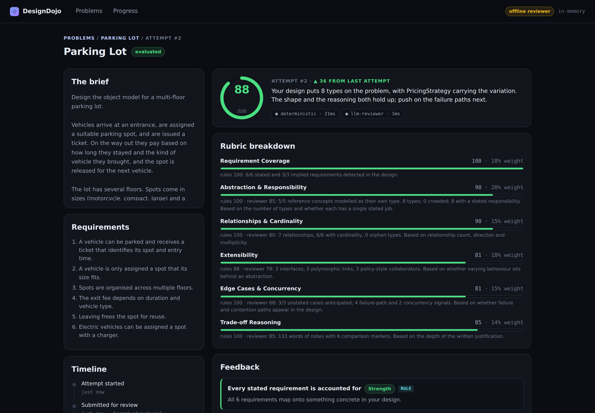
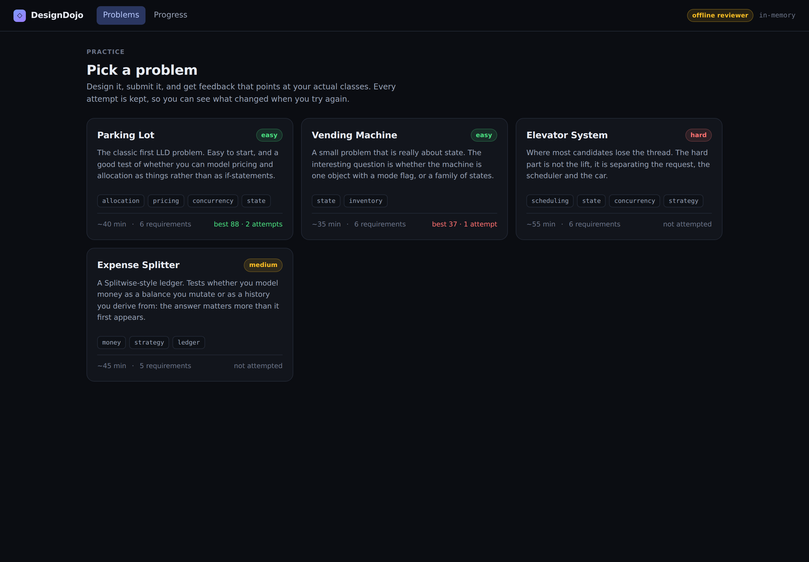
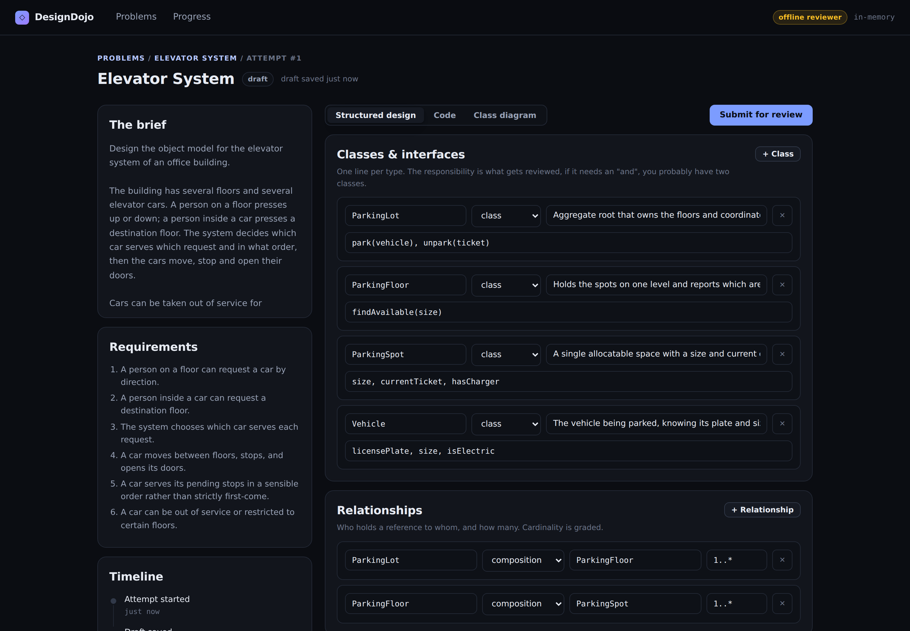
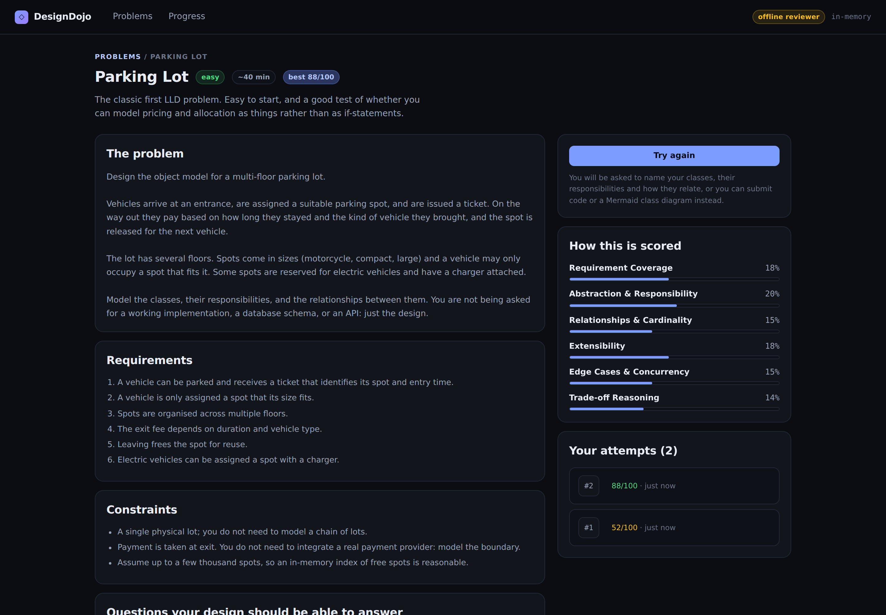
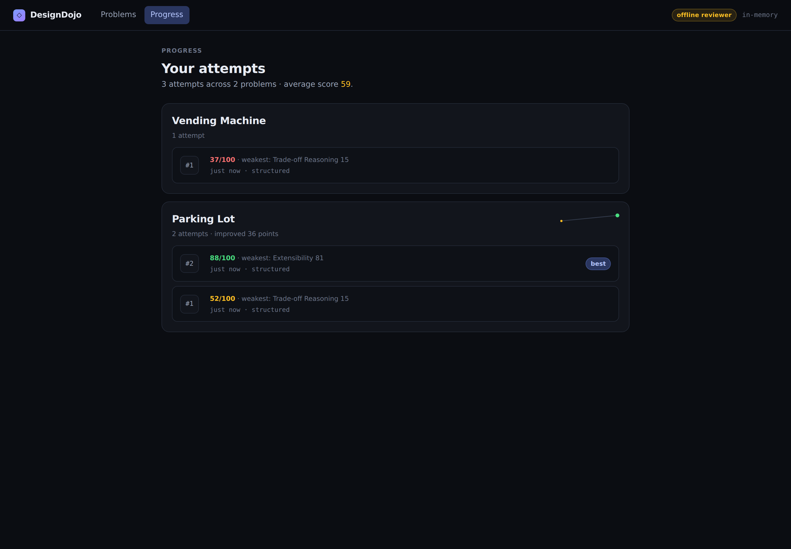

# DesignDojo: an LLD practice platform

Practise Low-Level Design the way you practise algorithms: pick a problem, submit a design, get feedback that points at your actual classes, and try again with the last review still in view.

Built for the CipherSchools 2-day engineering assignment.

| | |
| --- | --- |
| **Research note** | [`docs/RESEARCH.md`](docs/RESEARCH.md): the learner problem, what exists, the gaps, and the product direction |
| **Design note** | [`docs/DESIGN.md`](docs/DESIGN.md): MVP, flow, classes, evaluation approach, trade-offs |
| **AI usage** | [`AI_USAGE.md`](AI_USAGE.md): five decisions where AI changed the outcome, including the ones I rejected |

---

## Quick start

Requires **Node 20+**. No database and no API key needed.

```bash
npm install
npm run dev
```

- App → **http://localhost:5173**
- API → http://localhost:4000/api/health

That is the whole setup. With no `MONGODB_URI` the platform stores attempts in memory, and with no `ANTHROPIC_API_KEY` it uses an offline stand-in reviewer, labelled as such in the UI, so the full loop works on a fresh clone.

### With the real reviewer model

```bash
cp .env.example .env
# add ANTHROPIC_API_KEY=sk-ant-...
npm run dev
```

The header badge switches from `offline reviewer` to the model id. To persist attempts, add `MONGODB_URI=mongodb://localhost:27017/lld-practice`; the badge then reads `mongodb`.

### Tests

```bash
npm test        # 85 tests
npm run typecheck
```

---

## The loop

<p align="center">
  
</p>

**Choose → design → submit → review → try again.**

| | |
| --- | --- |
|  |  |
| **Catalogue**: four problems, your best score on each | **Workspace**: the brief beside the design, autosaved |
|  |  |
| **Brief**: requirements, constraints, and how it is scored | **Progress**: every attempt kept and charted |

---

## What makes the feedback useful

There is more than one correct design for a parking lot, so grading against a reference solution would be actively wrong. Three things fall out of taking that seriously.

### 1. Evaluation is split between rules and a model

Checkable things are decided by reproducible rules; judgement calls go to a language model. The rubric declares the blend **per dimension**:

| Dimension | Rules | Model | Why |
| --- | --- | --- | --- |
| Requirement Coverage | 70% | 30% | A finite authored checklist: mostly a fact |
| Relationships & Cardinality | 50% | 50% | Presence is a fact; correctness is judgement |
| Edge Cases & Concurrency | 40% | 60% | Vocabulary is detectable; sufficiency is not |
| Abstraction & Responsibility | 30% | 70% | Crowded classes are detectable; good taste is not |
| Extensibility | 30% | 70% | Seams are detectable; the *right* seams are not |
| Trade-off Reasoning | 0% | 100% | Only a reader can judge an argument |

The deterministic half is the platform's floor: dependency-free, single-digit milliseconds, identical every run. The model is given the rule findings and told not to repeat them, so the two compose into one review.

### 2. Every finding says where it came from

Each item is tagged `rule` or `reviewer` on screen. Requirement coverage shows the learner's own words that matched. A verdict you disagree with is something you can argue with, not something handed down, which matters a lot when the model is occasionally wrong.

### 3. Rules ask rather than assert

No check says a concept is missing. It says nothing was *detected* that owns it, and asks whether that was deliberate, with a score floor, so departing from the reference costs some marks and never all of them.

Concepts are graded three ways rather than two: **dedicated** (a type is named for it), **folded** (it exists only as a method on another class, half credit and a question), or **absent**. Full credit for folding it in would let name-dropping score as well as modelling; no credit would assert that one decomposition is the only right one.

---

## When evaluation is slow or fails

Evaluation is asynchronous, so submitting returns immediately with the attempt `queued` and the client polls. Three levels of failure handling, and at none of them is the learner's work lost:

1. **The model fails or returns unparseable JSON** → the review completes from the deterministic checks alone, flagged `degraded` with the reason, and the UI shows a partial-review banner with a re-run button.
2. **The whole run fails retryably** → re-queued with exponential backoff (1s, 2s, 4s), up to 3 runs.
3. **Runs exhausted** → the attempt lands in `failed` with the reason kept and the submission intact; the learner re-runs it with a fresh budget.

---

## Architecture

```
web/                        React + Vite, no UI framework
server/src/
  domain/                   ← no imports from anything below this line
    problem/                Problem, Rubric (dimensions + deterministic share)
    attempt/                Attempt aggregate, state machine, Submission union, DesignModel
    evaluation/             Evaluation value objects
  evaluation/
    normalizers/            Structured | Code | Diagram  →  DesignModel   (Strategy)
    deterministic/checks/   8 independent DesignChecks
    llm/                    LlmClient (Anthropic | offline), prompt, schema-validated parse
    EvaluationPipeline.ts   composes evaluators, degrades gracefully
    ScoreAggregator.ts      blends by the rubric's deterministic share
  application/              AttemptService, EvaluationWorker, JobQueue port
  infrastructure/           repositories (in-memory | Mongo), HTTP, seeded problems
  container.ts              the only file that names a concrete adapter
```

Dependencies point inward. The domain imports nothing from `infrastructure`, which is what lets the whole suite run against in-memory adapters in about a second.

### Extending it

| To add... | You write | You do not touch |
| --- | --- | --- |
| A submission format | one `SubmissionNormalizer` | any evaluator, service or route |
| An evaluation approach | one `Evaluator` | the pipeline, worker or lifecycle |
| A problem | one entry in `seedProblems()` | no code at all |
| A real queue / DB / model provider | one adapter | one line in `container.ts` |

---

## API

All routes are under `/api`. The learner is identified by an `x-learner-id` header (see *Limitations*).

| Method | Route | Purpose |
| --- | --- | --- |
| `GET` | `/health` | Storage and reviewer actually in use, queue depth |
| `GET` | `/problems` | Catalogue |
| `GET` | `/problems/:idOrSlug` | Brief, requirements, constraints, rubric weights |
| `POST` | `/attempts` | Start an attempt (`{ problemId }`) |
| `PUT` | `/attempts/:id/draft` | Autosave |
| `POST` | `/attempts/:id/submit` | Submit; returns immediately as `queued` |
| `GET` | `/attempts/:id` | Poll for status and the evaluation |
| `POST` | `/attempts/:id/reevaluate` | Re-run a failed evaluation |
| `GET` | `/attempts?problemId=` | History |

The grading key (requirement signals, reference concepts, pitfalls) never leaves the server; there is a test asserting it.

---

## Tests

85 tests, ~1.5s, no external services.

| File | Covers |
| --- | --- |
| `attempt-lifecycle.test.ts` | State machine: happy path, illegal transitions, retry budget, and that a rejected submission leaves the attempt editable |
| `evaluation-pipeline.test.ts` | Strong vs weak scoring separation, that the weak design is blamed for the *right* dimensions, reproducibility, the rule/model blend, and four degradation paths (model down, prose instead of JSON, wrong schema, fenced JSON) |
| `evaluation-worker.test.ts` | Retry with backoff, exhausting the budget into `failed`, learner-triggered re-run, redelivered jobs, previous-score context |
| `normalizers.test.ts` | TypeScript / Java / Python parsing, Mermaid arrow direction and cardinality, unparseable input, unregistered format |
| `scoring.test.ts` | Rubric normalisation and validation, blending, renormalising over assessed dimensions, clamping, JSON extraction edge cases |
| `api.test.ts` | End-to-end loop, repeat attempts showing improvement, cross-learner isolation, 422/409/404 paths, running with no reviewer at all |
| `problem-catalogue.test.ts` | Every seeded problem is completely authored, its rubric covers all six dimensions, its signals are actually matchable, and it separates a strong design from a generic one: a guard that covers each problem added later with no new fixture |
| `signal-matching.test.ts` | Word-boundary and inflection rules, camelCase/snake_case identifier splitting, and that a dedicated type scores above the same concept folded into a god class |

---

## Limitations

Honest about what this MVP is not:

- **No accounts.** A per-browser id in `localStorage`; clearing it loses your history. Isolated to one function on each side.
- **In-process queue.** A restart loses queued jobs, leaving the attempt in `queued` for a re-run. The `JobQueue` interface is the upgrade path.
- **Requirement coverage is signal matching, not comprehension.** It can be gamed by name-dropping and can miss unusual vocabulary. It shows its evidence precisely so you can see when it is wrong.
- **Code parsing is regex-based**, not an AST. It reads shape, not semantics; the model reads the raw source anyway.
- **The offline reviewer is not a model.** It is a heuristic stand-in so the loop works without a key, and it says so in the UI and in the evaluation's provenance.
- **Four problems**, seeded in code. Adding more is a content task, not an engineering one.
